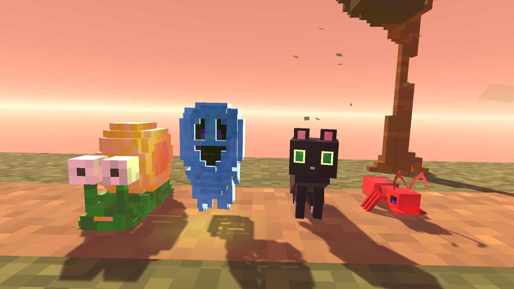
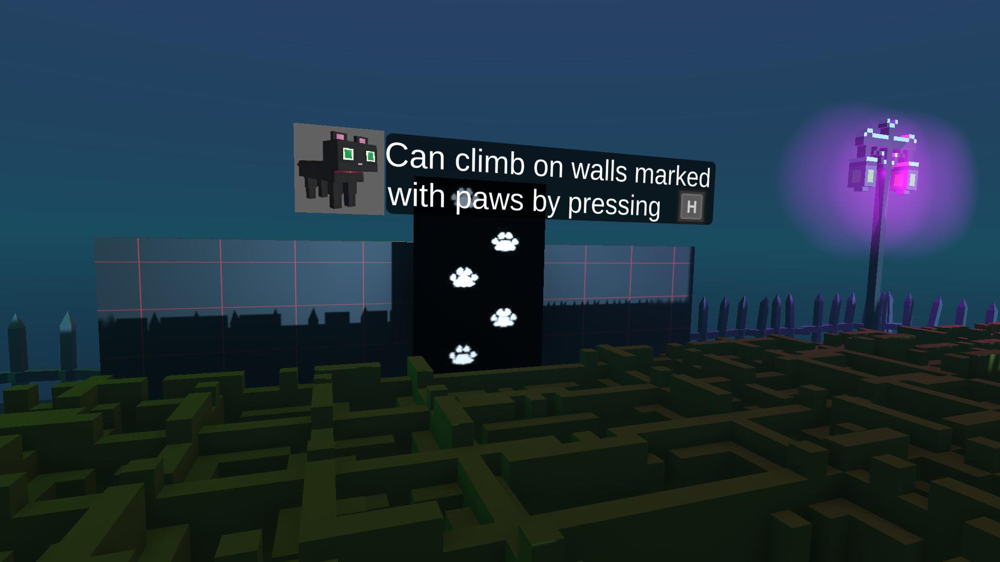

# Shape Shifters: A Unity "Toys-to-Life" Project

> **Note:** This repository is currently under construction. I am actively documenting and uploading curated code snippets from my thesis project to best showcase the architecture and key technical challenges. More content, including a video demo/GIF, will be added shortly.

## Overview

**Shape Shifters** is a 3D puzzle-platformer developed in Unity as my university thesis project. The core mechanic brings 3D-printed figurines to life inside the game using a custom-built NFC reader, inspired by games like *Skylanders* and *Lego Dimensions*.

The focus of the project was to develop modular, reusable, and easily expandable systems from scratch that can be leveraged in future projects.

## Technology Stack

*   **Software:** C# (.NET), Unity Engine
*   **Hardware:** Arduino Nano, NXP RC522 NFC Module
*   **Firmware:** C++ (for Arduino)

## Key Features & Technical Showcase

### 1. Custom Hardware & Communication Protocol

The entire hardware and software bridge was designed and built from the ground up.

*   **Hardware:** The physical reader uses an **Arduino Nano** and an **MFRC522 NFC module**.
*   **Software (C#):** A multithreaded C# script in Unity manages serial communication with the Arduino, listening for new NFC tag IDs without impacting game performance.

### 2. Modular Player State Machine

To support multiple characters with vastly different abilities, I implemented a flexible Finite State Machine (FSM). This architecture makes adding new characters or modifying existing ones simple and safe.

*   **Technical Highlights:** An object-oriented design using a base `PlayerBaseState` and concrete implementations for each character state.

---

## Thesis Project Summary

This project was completed as part of my formal university thesis. The key objectives were:

*   Design and independent implementation of a proof-of-concept system based on physical-digital interaction in a Unity-based puzzle-platformer prototype.
*   Development of custom Arduino-based NFC reader hardware and firmware to identify 3D-printed figurines.
*   Development and implementation of a bidirectional communication protocol between the hardware (Arduino) and software (Unity).